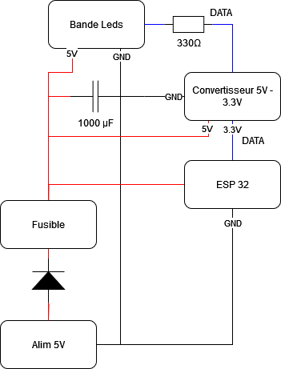

# Schéma Électronique (Version Test) pour le Boîtier d'Alimentation LED WS2812B avec ESP32

Ce document présente la version test du schéma électronique du boîtier d'alimentation LED, à ajuster au fur et à mesure du développement. Nous utilisons un microcontrôleur ESP32 pour contrôler les LEDs WS2812B, ainsi qu'un système d'alimentation sécurisé.

## Composants requis :
1. **Alimentation 5V 4-5A**
   - Fournit l'énergie nécessaire aux LEDs et à l'ESP32.
2. **ESP32**
   - Microcontrôleur pour contrôler les animations LED et la communication sans fil.
3. **Convertisseur de niveau logique 5V vers 3.3V**
   - Utilisé pour la communication entre l'ESP32 (3.3V) et les LEDs (5V).
4. **Bande LED WS2812B (1 mètre, 60 LEDs)**
5. **Condensateur 1000 µF, 6.3V ou 10V**
   - Stabilisation de la tension.
6. **Fusible rapide 5A**
   - Protection contre les surcharges.
7. **Diode Schottky (1N5819)** (optionnel)
   - Protection contre une inversion de polarité.
8. **Connecteur DC Barrel Jack femelle (5.5 mm x 2.1 mm)**

## Schéma électronique (Version Test) :

Voici le schéma électronique **test** pour ce projet :

## Explications du schéma :

1. **Alimentation 5V** :
   - Le connecteur DC Barrel Jack est utilisé pour connecter une alimentation 5V. Celle-ci alimente les bandes LED et l'ESP32.

2. **Condensateur** :
   - Le condensateur de **1000 µF** est placé entre le **+5V** et le **GND** pour éviter les pics de tension.

3. **Convertisseur de niveau logique 5V vers 3.3V** :
   - Utilisé entre la broche de données du WS2812B (qui fonctionne en 5V) et la broche GPIO de l'ESP32 (qui fonctionne en 3.3V).
   - Assure une communication fiable entre les LEDs et l'ESP32.

4. **ESP32** :
   - Alimenté par le 5V, mais communique en 3.3V avec le convertisseur. Une broche GPIO de l'ESP32 est connectée au **Data In** de la bande LED via le convertisseur de niveau logique.

5. **Fusible** :
   - Un fusible de **5A** protège l'ensemble du circuit contre les surcharges potentielles.

6. **Diode Schottky** :
   - La diode protège le circuit contre une inversion accidentelle de polarité.

---

## Notes supplémentaires :
- Ce schéma est une **version test** et peut évoluer avec le projet.
- Le convertisseur de niveau logique est indispensable pour la communication fiable entre les composants 5V et 3.3V.
