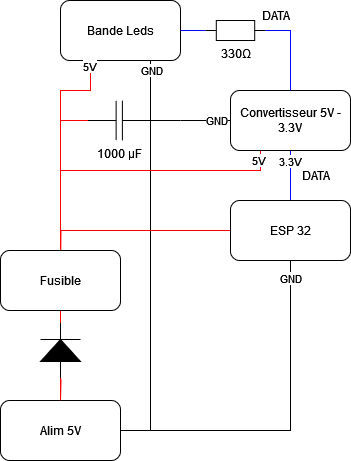

### **Electronic Schematic (Test Version) for the WS2812B LED Power Box with ESP32**

This document outlines the test version of the electronic schematic for the LED power box, which will be adjusted as development progresses. We are using an ESP32 microcontroller to control WS2812B LEDs, along with a safe power supply system.

## Required Components:
- **5V 4-5A Power Supply**: Provides the necessary power for the LEDs and the ESP32.
- **ESP32**: Microcontroller to manage the animations and control the LEDs.
- **WS2812B LED Strip**: 60 LEDs per meter, individually addressable.
- **Logic Level Converter**: To convert the 3.3V signal (ESP32 output) to 5V for the LEDs.
- **1000 µF Capacitor**: To stabilize the voltage.
- **330Ω Resistor**: For the **Data In** pin of the LEDs.
- **5A Fuse**: To protect the circuit in case of overcurrent.
- **Schottky Diode (1N5819)**: Protection against reverse polarity.
- **Female DC Barrel Jack Connector (5.5 mm x 2.1 mm)**: Connects the power supply to the circuit.
- **KY-038/KY-037 Sound Sensor**: Captures audio signals to sync LED animations with music.

## Electronic Schematic (Test Version):

Here is the **test version** of the electronic schematic for this project:

## Schematic Explanation:

- **5V Power Supply**:
   - The DC Barrel Jack connector is used to connect a 5V power supply. This provides power to both the LED strip and the ESP32.

- **Capacitor**:
   - The **1000 µF** capacitor is placed between **+5V** and **GND** to prevent voltage spikes.

- **Logic Level Converter (3.3V to 5V)**:
   - Used between the data pin of the WS2812B (which operates at 5V) and the GPIO pin of the ESP32 (which operates at 3.3V).
   - Ensures reliable communication between the LEDs and the ESP32.

- **ESP32**:
   - The ESP32 controls the LED strip and processes the sound sensor input. It communicates with the WS2812B LED strip via one of its GPIO pins, which is connected to the Data In pin of the LED strip through the logic level converter. The sound sensor is also connected to one of the GPIO pins. The ESP32 is powered by the same 5V supply.

- **Resistor**:
   - A **330Ω resistor** is placed between the **Data In** pin of the LED strip and the data line from the ESP32 (after the logic level conversion) to prevent current spikes.

- **Fuse**:
   - A **5A fuse** protects the entire circuit from potential overcurrent.

- **Schottky Diode**:
   - The diode protects the circuit from accidental reverse polarity connections.
 
- **KY-038 / KY-037 Sound Sensor**:
   - The KY-038 (or KY-037) sound sensor is used to detect ambient sound levels, which will control the LED animations. The sensor has an analog output (A0) and a digital output (D0). For our purpose, we will use the analog output to detect continuous sound levels.

---

## Additional Notes:
- This is a **test version** of the schematic and may evolve as the project develops.
- The logic level converter and resistor are essential for reliable communication between the 5V and 3.3V components.
